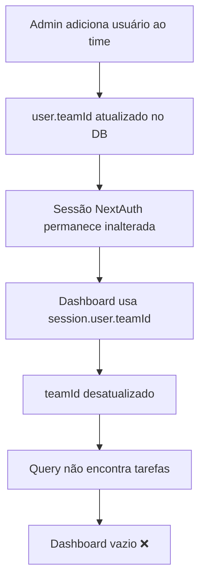

# 🏗️ Arquitetura da Solução: Fix Dashboard Copyrighter

## 📋 Índice
1. [Diagnóstico do Problema](#diagnóstico-do-problema)
2. [Causa Raiz](#causa-raiz)
3. [Soluções Propostas](#soluções-propostas)
4. [Cenários de Teste](#cenários-de-teste)
5. [Plano de Implementação](#plano-de-implementação)
6. [Melhorias UX](#melhorias-ux)

---

## 🔍 Diagnóstico do Problema

### Contexto
- **Usuário**: Filipe (copyrighter)
- **Time**: Copywriting
- **Situação**: Usuário foi adicionado ao time DEPOIS da tarefa ter sido criada
- **Problema**: Dashboard mostra "Você não tem tarefas ativas. Bom trabalho!" mesmo existindo tarefas

### Cenário Exato
```
✅ Tarefa: Existe no template "Landing Page"
✅ currentStage: "Briefing & Copy" (defaultTeamId: Copywriting)
✅ assigneeId: null (não atribuída)
✅ status: BACKLOG
✅ Usuário Filipe: teamId = Copywriting (correto no banco)
❌ PROBLEMA: Tarefa não aparece no dashboard
```

---

## 🎯 Causa Raiz

### Problema de Sincronização de Sessão

A query do dashboard está **CORRETA**, mas há um **bug de cache de sessão**:

```typescript
// Linha 206 em app/(protected)/dashboard/page.tsx
const teamId = session.user.teamId; // ← Vem da sessão (pode estar desatualizado!)

// Query na linha 226-232
prisma.task.findMany({
  where: {
    assigneeId: null,
    status: TaskStatus.BACKLOG,
    currentStage: {
      defaultTeamId: teamId, // ← Usa teamId da sessão
    },
  },
})
```

### Por que isso acontece?

1. **Admin cria tarefa** → currentStage.defaultTeamId = Copywriting ✅
2. **Admin adiciona Filipe ao time Copywriting** → user.teamId atualizado no banco ✅
3. **Filipe já estava logado** → session.user.teamId NÃO é atualizado ❌
4. **Dashboard usa sessão desatualizada** → teamId = null ou antigo ❌
5. **Query não encontra tarefas** → Dashboard vazio ❌

### Fluxo do Problema



---

## 💡 Soluções Propostas

### ✅ Solução 1: Buscar teamId do Banco (RECOMENDADA)

**Mudança em [`app/(protected)/dashboard/page.tsx`](app/(protected)/dashboard/page.tsx:203-206):**

```typescript
// ❌ ANTES (usa sessão desatualizada)
const userId = session.user.id;
const teamId = session.user.teamId;

// ✅ DEPOIS (busca dados atuais do banco)
const userId = session.user.id;

const currentUser = await prisma.user.findUnique({
  where: { id: userId },
  select: { teamId: true }
});
const teamId = currentUser?.teamId;
```

**Vantagens:**
- ✅ Sempre atualizado
- ✅ Não requer logout/login
- ✅ Mudança mínima (3 linhas)
- ✅ Performance impacto negligível (+1 query simples)

---

### 🛡️ Solução 2: Invalidar Sessão ao Atualizar

Forçar logout quando admin muda teamId:

```typescript
// Em onde atualiza usuários
export async function updateUserTeam(userId: string, teamId: string) {
  await prisma.user.update({
    where: { id: userId },
    data: { teamId }
  });
  
  // Invalidar sessões do usuário
  await prisma.session.deleteMany({
    where: { userId }
  });
}
```

**Desvantagens:**
- ❌ UX ruim (força logout)
- ❌ Mais complexo

---

### 🔄 Solução 3: Callback de Sessão Dinâmico

Modificar [`auth.config.ts`](auth.config.ts:16):

```typescript
callbacks: {
  async session({ session, user }) {
    // Buscar dados atualizados sempre
    const freshUser = await prisma.user.findUnique({
      where: { id: user.id },
      select: { id: true, role: true, teamId: true }
    });
    
    session.user.id = freshUser.id;
    session.user.role = freshUser.role;
    session.user.teamId = freshUser.teamId;
    
    return session;
  },
}
```

**Desvantagens:**
- ❌ Query em TODA requisição
- ❌ Impacto global na performance

---

## ✅ Solução Híbrida (IMPLEMENTAR)

1. **Curto prazo**: Solução 1 no dashboard
2. **Médio prazo**: Notificação visual ao atualizar usuário
3. **Longo prazo**: Cache inteligente na sessão

---

## 📝 Cenários de Teste

### Teste 1: Usuário Adicionado ao Time ✅ (Cenário Atual)
```
DADO:
- Tarefa criada no backlog de Copywriting
- Filipe NÃO estava no time
- Admin adiciona Filipe ao Copywriting

QUANDO:
- Filipe acessa /dashboard

ENTÃO:
- ✅ Tarefa DEVE aparecer SEM logout/login
```

### Teste 2: Tarefa Atribuída
```
DADO:
- Tarefa no backlog não atribuída

QUANDO:
- Supervisor atribui ao Filipe

ENTÃO:
- ✅ Move para "Minhas Tarefas Ativas"
- ✅ Sai de "Backlog da Equipe"
```

### Teste 3: Tarefa de Outro Time
```
DADO:
- Tarefa na etapa "Design" (defaultTeamId: Designers)

QUANDO:
- Filipe (Copywriting) acessa dashboard

ENTÃO:
- ❌ Tarefa NÃO aparece
- ✅ Aparece para Designers
```

### Teste 4: Múltiplas Tarefas
```
DADO:
- 3 tarefas no Copywriting:
  1. BACKLOG, não atribuída
  2. IN_PROGRESS, não atribuída
  3. PAUSED, não atribuída

ENTÃO:
- ✅ Todas aparecem em "Backlog da Equipe"
- ✅ Ordenadas por createdAt (mais antiga primeiro)
```

### Teste 5: Usuário Sem Team
```
DADO:
- Filipe.teamId = null

QUANDO:
- Acessa /dashboard

ENTÃO:
- ✅ Mostra mensagem explicativa
- ✅ Não causa erro/crash
```

### Teste 6: Tarefa Avançada
```
DADO:
- Tarefa em "Briefing & Copy"

QUANDO:
- Filipe avança para "Design"

ENTÃO:
- ❌ Sai do dashboard do Filipe
- ✅ Aparece no dashboard dos Designers
```

### Teste 7: Performance
```
DADO:
- 100+ tarefas no sistema
- 20 no backlog de Copywriting

ENTÃO:
- ✅ Carrega em < 2 segundos
- ✅ Query otimizada (sem N+1)
```

---

## 🚀 Plano de Implementação

### Fase 1: Fix Crítico ⚡ (30 minutos)

**Arquivo**: [`app/(protected)/dashboard/page.tsx`](app/(protected)/dashboard/page.tsx:203)

**Mudanças**:
1. Substituir `session.user.teamId` por query ao banco
2. Adicionar validação para `teamId === null`
3. Mostrar mensagem apropriada quando sem time

**Código**:
```typescript
// Linha 203-206
const userId = session.user.id;

// Buscar teamId atual do banco
const currentUser = await prisma.user.findUnique({
  where: { id: userId },
  select: { teamId: true }
});
const teamId = currentUser?.teamId;

// Validação: usuário sem time
if (!teamId) {
  return (
    <div className="container mx-auto py-6 px-4">
      <div className="mb-8">
        <h1 className="text-3xl font-bold text-foreground">
          Olá, {session.user.name?.split(" ")[0] || "Usuário"}!
        </h1>
        <p className="mt-2 text-sm text-muted-foreground">
          Você ainda não foi atribuído a um time. Entre em contato com o administrador.
        </p>
      </div>
    </div>
  );
}

// Continua com queries normais...
```

---

### Fase 2: Melhorias UX 🎨 (1-2 horas)

#### 2.1 Widget de Estatísticas
Adicionar card com métricas no topo:

```typescript
interface UserStats {
  activeTasks: number;
  completedThisWeek: number;
  hoursLoggedToday: number;
  upcomingDeadlines: number;
}

// Query para estatísticas
const stats: UserStats = await prisma.$transaction(async (tx) => {
  const [activeTasks, completedThisWeek, hoursLoggedToday, upcomingDeadlines] = await Promise.all([
    tx.task.count({
      where: {
        assigneeId: userId,
        status: { in: [TaskStatus.BACKLOG, TaskStatus.IN_PROGRESS, TaskStatus.PAUSED] }
      }
    }),
    tx.task.count({
      where: {
        assigneeId: userId,
        status: TaskStatus.COMPLETED,
        completedAt: { gte: new Date(Date.now() - 7 * 24 * 60 * 60 * 1000) }
      }
    }),
    tx.timeLog.aggregate({
      where: {
        userId,
        logDate: { gte: new Date(new Date().setHours(0, 0, 0, 0)) }
      },
      _sum: { hoursSpent: true }
    }).then(res => res._sum.hoursSpent || 0),
    tx.task.count({
      where: {
        assigneeId: userId,
        status: { not: TaskStatus.COMPLETED },
        dueDate: {
          lte: new Date(Date.now() + 3 * 24 * 60 * 60 * 1000) // 3 dias
        }
      }
    })
  ]);

  return {
    activeTasks,
    completedThisWeek,
    hoursLoggedToday,
    upcomingDeadlines
  };
});
```

#### 2.2 Indicadores Visuais de Urgência

```typescript
function TaskRow({ task }: { task: TaskWithDetails }) {
  const isOverdue = task.dueDate && new Date(task.dueDate) < new Date();
  const isDueSoon = task.dueDate && 
    new Date(task.dueDate).getTime() - Date.now() < 2 * 24 * 60 * 60 * 1000;

  return (
    <tr className={`
      hover:bg-muted/50 transition-colors border-b border-border
      ${isOverdue ? 'bg-red-50 dark:bg-red-950/20' : ''}
      ${isDueSoon && !isOverdue ? 'bg-yellow-50 dark:bg-yellow-950/20' : ''}
    `}>
      <td className="px-4 py-3">
        <div className="flex items-center gap-2">
          {isOverdue && <span title="Atrasada">🔥</span>}
          {isDueSoon && !isOverdue && <span title="Prazo próximo">⚠️</span>}
          <Link
            href={`/tasks/${task.id}`}
            className="text-sm font-medium text-primary hover:underline"
          >
            {task.title}
          </Link>
        </div>
      </td>
      {/* resto */}
    </tr>
  );
}
```

---

## 📊 Estrutura de Arquivos Afetados

```
app/(protected)/dashboard/
├── page.tsx (MODIFICAR - Linhas 203-263)
│   ├── Adicionar query de teamId do banco
│   ├── Adicionar validação de usuário sem time
│   ├── Adicionar query de estatísticas
│   └── Modificar TaskRow com indicadores visuais
│
└── components/ (CRIAR - Opcional)
    ├── StatsCard.tsx
    ├── TaskRow.tsx
    └── UserStats.tsx
```

---

## 🎯 Resumo de Mudanças

| Arquivo | Linhas | Mudança | Prioridade |
|---------|--------|---------|------------|
| [`app/(protected)/dashboard/page.tsx`](app/(protected)/dashboard/page.tsx:203) | 203-206 | 🔴 Buscar teamId do banco | Alta |
| [`app/(protected)/dashboard/page.tsx`](app/(protected)/dashboard/page.tsx:242) | 210-241 | 🟡 Adicionar query de stats | Média |
| [`app/(protected)/dashboard/page.tsx`](app/(protected)/dashboard/page.tsx:91) | 91-124 | 🟡 Indicadores visuais | Média |

---

## ⏱️ Cronograma

```
Fase 1 (Crítica): 30 minutos
├── Modificar query teamId (10 min)
├── Adicionar validação (10 min)
└── Testar cenário principal (10 min)

Fase 2 (UX): 1-2 horas
├── Implementar widget stats (45 min)
├── Adicionar indicadores visuais (30 min)
└── Testes completos (45 min)

Total: 2-2.5 horas
```

---

## ✅ Checklist de Implementação

### Fase 1 - Fix Crítico
- [ ] Substituir `session.user.teamId` por query ao banco
- [ ] Adicionar validação `if (!teamId)`
- [ ] Mostrar mensagem quando usuário sem time
- [ ] Testar: usuário adicionado ao time vê tarefas

### Fase 2 - Melhorias UX
- [ ] Criar interface `UserStats`
- [ ] Implementar query de estatísticas
- [ ] Criar componente `StatsCard`
- [ ] Adicionar indicadores visuais (🔥⚠️)
- [ ] Adicionar background colorido para urgência
- [ ] Testar todos os cenários

### Validação Final
- [ ] Teste manual: Admin adiciona usuário → vê tarefas
- [ ] Teste manual: Usuário sem time → mensagem apropriada
- [ ] Teste manual: Tarefas atrasadas → destaque vermelho
- [ ] Teste performance: 100+ tarefas → < 2s
- [ ] Code review: TypeScript types corretos
- [ ] Code review: Sem console.logs em produção

---

## 🔒 Considerações de Segurança

1. **Validação de Acesso**: Query verifica apenas tarefas do time do usuário
2. **SQL Injection**: Prisma previne automaticamente
3. **XSS**: Next.js escapa HTML automaticamente
4. **Performance**: Queries otimizadas com `select` específicos

---

## 📈 Métricas de Sucesso

- ✅ **Funcionalidade**: Dashboard mostra tarefas imediatamente após adição ao time
- ✅ **Performance**: Carregamento < 2 segundos com 100+ tarefas
- ✅ **UX**: Indicadores visuais claros para urgência
- ✅ **Robustez**: Sem crashes quando usuário sem team

---

**Data**: 2025-11-04  
**Versão**: 1.0  
**Status**: Pronto para Implementação ✅