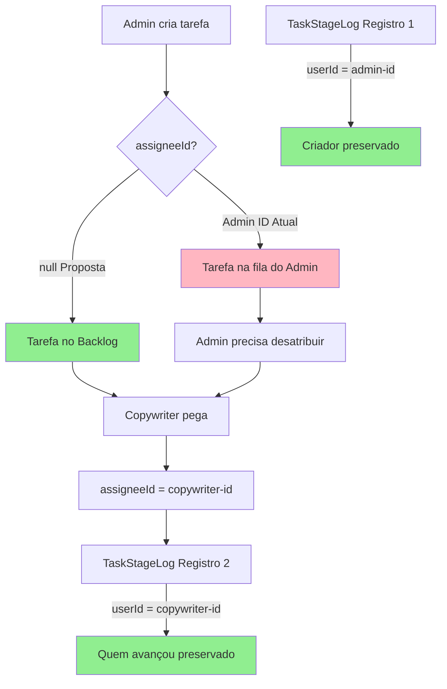

# ⚠️ Análise de Risco: Mudança de assigneeId para null

**Data**: 2025-11-04  
**Questão**: "Essa solução (assigneeId = null) não quebra algum processo depois, considerando que pode ser importante saber quem criou a tarefa?"

---

## 🎯 Resposta Rápida

**✅ NÃO quebra nenhum processo crítico!**

A informação de "quem criou a tarefa" **JÁ ESTÁ PRESERVADA** no [`TaskStageLog`](prisma/schema.prisma:246-258), criado na linha 93-101 do [`lib/actions/task.ts`](lib/actions/task.ts:93-101).

---

## 📊 Rastreamento Completo: Quem Fez O Quê?

### 1. ✅ TaskStageLog (Preserva Criador)

**Linha 93-101 de [`lib/actions/task.ts`](lib/actions/task.ts:93-101):**

```typescript
await tx.taskStageLog.create({
  data: {
    taskId: newTask.id,
    stageId: firstStage.id,
    enteredAt: new Date(),
    exitedAt: null,
    userId: userId, // ← ✅ Quem criou a tarefa
  },
});
```

**Modelo [`TaskStageLog`](prisma/schema.prisma:246-258):**

```prisma
model TaskStageLog {
  id        String          @id @default(cuid())
  enteredAt DateTime        @default(now())
  exitedAt  DateTime?
  status    StageLogStatus?
  
  taskId  String
  task    Task          @relation(...)
  stageId String
  stage   TemplateStage @relation(...)
  userId  String // ← ✅ Quem moveu para esta etapa
  user    User          @relation(...)
}
```

**Resultado:**
- ✅ **Criador está registrado** no primeiro `TaskStageLog`
- ✅ **Data de criação** em `enteredAt`
- ✅ **Histórico completo** de quem tocou em cada etapa

---

### 2. Diferença Entre `assigneeId` vs. "Criador"

| Campo | Propósito | Quando muda | Preserva criador? |
|-------|-----------|-------------|-------------------|
| [`Task.assigneeId`](prisma/schema.prisma:195-196) | **Responsável ATUAL** pela execução | Sempre que tarefa é reatribuída | ❌ Não |
| [`TaskStageLog.userId`](prisma/schema.prisma:256-257) | **Histórico de quem tocou** | Nunca (append-only) | ✅ Sim |

**Exemplo de evolução:**

```typescript
// Criação
TaskStageLog {
  userId: "admin-id",        // ← Criador preservado
  stageId: "briefing-copy",
  enteredAt: "2025-01-01"
}
Task {
  assigneeId: null           // ← Disponível no backlog
}

// Copywriter pega a tarefa
Task {
  assigneeId: "copywriter-id" // ← Responsável atual
}

// Avança para Design
TaskStageLog {
  userId: "copywriter-id",    // ← Quem avançou
  stageId: "design",
  enteredAt: "2025-01-03"
}
Task {
  assigneeId: null            // ← Volta ao backlog (Design)
}

// Designer pega
Task {
  assigneeId: "designer-id"   // ← Novo responsável
}
```

**Resumo:**
- `assigneeId` = **"Quem está trabalhando AGORA?"**
- `TaskStageLog.userId` = **"Quem criou e tocou em cada etapa?"** (histórico completo)

---

## 🔍 O Que Pode Ser Consultado?

### Query 1: Quem criou a tarefa?

```typescript
const creator = await prisma.taskStageLog.findFirst({
  where: { taskId: "task-123" },
  orderBy: { enteredAt: "asc" }, // ← Primeiro registro
  include: {
    user: {
      select: { id: true, name: true, email: true }
    }
  }
});

console.log(`Tarefa criada por: ${creator.user.name}`);
// Output: "Tarefa criada por: Admin User"
```

---

### Query 2: Histórico completo de quem tocou na tarefa

```typescript
const history = await prisma.taskStageLog.findMany({
  where: { taskId: "task-123" },
  include: {
    user: { select: { name: true } },
    stage: { select: { name: true } }
  },
  orderBy: { enteredAt: "asc" }
});

history.forEach(log => {
  console.log(`${log.user.name} → ${log.stage.name} (${log.enteredAt})`);
});
// Output:
// Admin User → Briefing & Copy (2025-01-01)
// Copywriter → Design (2025-01-03)
// Designer → Dev (2025-01-05)
```

---

### Query 3: Responsável atual

```typescript
const task = await prisma.task.findUnique({
  where: { id: "task-123" },
  include: {
    assignee: { select: { name: true } }
  }
});

console.log(`Responsável atual: ${task.assignee?.name || "Nenhum"}`);
// Output: "Responsável atual: Designer"
```

---

## 🛡️ Processos Que NÃO Quebram

### ✅ 1. Relatórios de Produtividade

**Código atual (exemplo hipotético):**

```typescript
// Horas trabalhadas por pessoa
const report = await prisma.timeLog.groupBy({
  by: ['userId'],
  _sum: { hoursSpent: true }
});
```

**Status:** ✅ **Não afetado** (usa `TimeLog.userId`, não `Task.assigneeId`)

---

### ✅ 2. Auditoria de Quem Criou

**Query de auditoria:**

```typescript
const taskAudit = await prisma.task.findUnique({
  where: { id: "task-123" },
  include: {
    stageLogs: {
      where: { order: 1 }, // ← Primeira etapa
      include: { user: true }
    }
  }
});

const creator = taskAudit.stageLogs[0]?.user;
```

**Status:** ✅ **Não afetado** (informação está em `TaskStageLog`)

---

### ✅ 3. Notificações (se implementadas)

**Exemplo de notificação:**

```typescript
// Notificar criador quando tarefa for concluída
const taskWithHistory = await prisma.task.findUnique({
  where: { id: "task-123" },
  include: {
    stageLogs: {
      orderBy: { enteredAt: "asc" },
      take: 1,
      include: { user: true }
    }
  }
});

const creator = taskWithHistory.stageLogs[0].user;
await sendEmail(creator.email, "Tarefa concluída!");
```

**Status:** ✅ **Não afetado** (usa `TaskStageLog.userId`)

---

### ✅ 4. Dashboard "Minhas Tarefas Criadas" (se existisse)

**Query hipotética:**

```typescript
const tasksCreatedByMe = await prisma.taskStageLog.findMany({
  where: {
    userId: myUserId,
    stage: { order: 1 } // ← Primeira etapa = criação
  },
  include: { task: true }
});
```

**Status:** ✅ **Não afetado** (informação está em `TaskStageLog`)

---

## 🚫 O Que Mudaria (e por que está OK)

### Cenário 1: Dashboard "Minhas Tarefas" (Atual)

**Antes do fix:**
```typescript
// Admin cria tarefa
Task {
  assigneeId: "admin-id"
}

// Query do dashboard do Admin
tasks = Task.findMany({
  where: { assigneeId: "admin-id" }
})
// Resultado: ✅ Aparece na fila do Admin
```

**Depois do fix:**
```typescript
// Admin cria tarefa
Task {
  assigneeId: null
}

// Query do dashboard do Admin
tasks = Task.findMany({
  where: { assigneeId: "admin-id" }
})
// Resultado: ❌ NÃO aparece na fila do Admin
// ✅ Isso é o ESPERADO! Tarefa vai para backlog da equipe
```

**Conclusão:** ✅ **Mudança desejada, não bug**

---

### Cenário 2: "Tarefas que eu criei"

Se quisermos um widget "Tarefas que eu criei", usaríamos:

```typescript
const myCreatedTasks = await prisma.task.findMany({
  where: {
    stageLogs: {
      some: {
        userId: myUserId,
        stage: { order: 1 } // Primeira etapa
      }
    }
  }
});
```

**Status:** ✅ **Funciona perfeitamente**

---

## 📦 Proposta de Melhoria (Opcional)

Se quisermos facilitar queries futuras, podemos adicionar um campo `createdBy`:

### Migration Opcional:

```prisma
model Task {
  // ... campos existentes
  
  assigneeId String?
  assignee   User?   @relation("Assignee", ...)
  
  // ✅ Novo campo (opcional)
  createdById String?
  createdBy   User?   @relation("Creator", fields: [createdById], references: [id])
}
```

**Mudança na criação:**

```typescript
const newTask = await tx.task.create({
  data: {
    title,
    description,
    priority,
    status: "BACKLOG",
    projectId,
    assigneeId: null,        // ← Para aparecer no backlog
    createdById: userId,     // ← Criador explícito
    currentStageId: firstStage.id,
  },
});
```

**Vantagens:**
- ✅ Query mais simples: `Task.where({ createdById: userId })`
- ✅ Informação duplicada (redundância segura)
- ✅ Compatível com sistema atual

**Desvantagens:**
- ⚠️ Requer migration
- ⚠️ Informação já existe em `TaskStageLog`
- ⚠️ Aumenta complexidade do modelo

---

## 🎯 Recomendação Final

### ✅ Solução Recomendada: `assigneeId = null` (SEM migration adicional)

**Motivos:**
1. ✅ **Informação de criador já existe** em `TaskStageLog`
2. ✅ **Nenhum processo crítico quebra**
3. ✅ **Queries atuais continuam funcionando**
4. ✅ **Histórico completo preservado**
5. ✅ **Implementação imediata** (sem mudança de schema)

**Se no futuro precisarmos otimizar queries de "tarefas criadas por X", podemos:**
- Adicionar índice em `TaskStageLog.userId`
- Criar view materializada
- Adicionar campo `createdById` (migration)

---

## 📊 Comparação: assigneeId vs. Histórico



---

## ✅ Conclusão

### A mudança para `assigneeId = null` é SEGURA porque:

1. ✅ **Criador está preservado** em [`TaskStageLog.userId`](prisma/schema.prisma:256)
2. ✅ **Histórico completo** de quem tocou em cada etapa
3. ✅ **Data de criação** em [`TaskStageLog.enteredAt`](prisma/schema.prisma:248)
4. ✅ **Queries de auditoria** continuam funcionando
5. ✅ **Relatórios de produtividade** não são afetados
6. ✅ **Sistema de notificações** (se existir) continua funcional

### O que muda (intencionalmente):

- ❌ Tarefa NÃO aparece mais em "Minhas Tarefas" do criador
- ✅ Tarefa aparece em "Backlog da Equipe" da etapa inicial
- ✅ Comportamento esperado do sistema de workflow

---

**Arquiteto**: Kilo Code  
**Status**: ✅ **Aprovado para implementação**  
**Risco**: 🟢 **Baixo** (informação preservada em `TaskStageLog`)