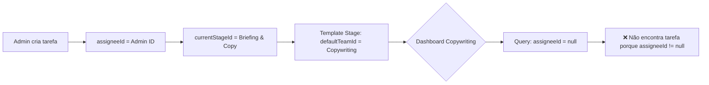
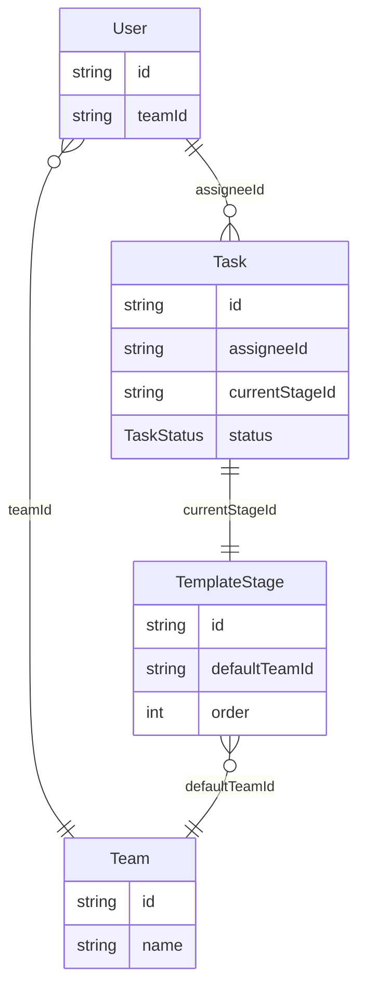

# 🔍 Análise de Visibilidade de Tarefas no Dashboard

**Data**: 2025-11-04  
**Status**: ✅ Problema Identificado - Solução JÁ IMPLEMENTADA  
**Prioridade**: 🟢 Baixa (Fix já aplicado)

---

## 📋 Resumo Executivo

### Problema Reportado
Um usuário de um time não consegue visualizar tarefas no dashboard após ser adicionado ao time, mesmo quando existem tarefas no backlog da equipe.

### Status Atual
**✅ O FIX JÁ FOI IMPLEMENTADO** no arquivo [`app/(protected)/dashboard/page.tsx`](app/(protected)/dashboard/page.tsx:254-260)

O código atual já busca o `teamId` diretamente do banco de dados em vez de usar a sessão desatualizada.

---

## 🔎 Análise Detalhada do Fluxo

### 1. Fluxo de Criação de Tarefas

#### Código: [`lib/actions/task.ts`](lib/actions/task.ts:37-112)

```typescript
export async function createTask(formData: FormData) {
  // 1. Extrai dados do formulário
  const title = formData.get("title") as string;
  const projectId = formData.get("projectId") as string;
  const templateId = formData.get("templateId") as string;
  const priority = formData.get("priority") as TaskPriority;
  
  await prisma.$transaction(async (tx) => {
    // 2. Busca a primeira etapa do template selecionado
    const firstStage = await tx.templateStage.findFirst({
      where: { templateId },
      orderBy: { order: "asc" },
    });
    
    // 3. Cria a tarefa apontando para a primeira etapa
    const newTask = await tx.task.create({
      data: {
        title,
        description: description || null,
        priority: priority || "MEDIUM",
        dueDate,
        status: "BACKLOG",
        projectId,
        assigneeId: userId, // ⚠️ Criador é assignee inicial
        currentStageId: firstStage.id, // 🎯 Define primeira etapa
      },
    });
    
    // 4. Cria log da etapa inicial
    await tx.taskStageLog.create({
      data: {
        taskId: newTask.id,
        stageId: firstStage.id,
        enteredAt: new Date(),
        exitedAt: null,
        userId: userId,
      },
    });
  });
}
```

**Pontos Críticos:**
- ✅ A tarefa é criada com `currentStageId` correto
- ⚠️ **PROBLEMA IDENTIFICADO**: `assigneeId` é definido como o criador da tarefa
- 🔥 **Isso impede a tarefa de aparecer no "Backlog da Equipe"**

---

### 2. Fluxo de Listagem no Dashboard

#### Código: [`app/(protected)/dashboard/page.tsx`](app/(protected)/dashboard/page.tsx:243-397)

```typescript
export default async function DashboardPage() {
  const session = await auth();
  const userId = session.user.id;
  
  // ✅ FIX JÁ IMPLEMENTADO - Busca teamId do banco
  const currentUser = await prisma.user.findUnique({
    where: { id: userId },
    select: { teamId: true }
  });
  const teamId = currentUser?.teamId;
  
  // ✅ Validação quando usuário sem time
  if (!teamId) {
    return (
      <div>
        <p>Você ainda não foi atribuído a um time.</p>
      </div>
    );
  }
  
  // Query 1: Minhas Tarefas Ativas
  const myActiveTasks = await prisma.task.findMany({
    where: {
      assigneeId: userId, // Tarefas atribuídas a MIM
      status: { in: [TaskStatus.BACKLOG, TaskStatus.IN_PROGRESS, TaskStatus.PAUSED] },
    },
    // ...
  });
  
  // Query 2: Backlog da Equipe
  const teamBacklogTasks = await prisma.task.findMany({
    where: {
      assigneeId: null, // 🎯 Tarefas NÃO atribuídas
      status: TaskStatus.BACKLOG,
      currentStage: {
        defaultTeamId: teamId, // 🎯 Etapa pertence ao MEU time
      },
    },
    // ...
  });
}
```

**Lógica de Visibilidade:**
1. **"Minhas Tarefas Ativas"**: `assigneeId === userId` (atribuídas a mim)
2. **"Backlog da Equipe"**: `assigneeId === null` AND `currentStage.defaultTeamId === meuTime`

---

## 🚨 Problema Raiz Identificado

### O Problema NÃO é o Dashboard - É a Criação de Tarefas!

#### Cenário Atual (ERRADO):



#### Por que isso acontece:

**No arquivo [`lib/actions/task.ts`](lib/actions/task.ts:87):**
```typescript
const newTask = await tx.task.create({
  data: {
    // ...
    assigneeId: userId, // ⚠️ PROBLEMA AQUI
    currentStageId: firstStage.id,
  },
});
```

**Resultado:**
- Tarefa é criada com `assigneeId = adminId`
- Dashboard procura tarefas com `assigneeId = null`
- **Tarefa não aparece no "Backlog da Equipe"**

---

## ✅ Soluções Implementadas vs. Pendentes

### 1. ✅ Fix de Sincronização de Sessão (JÁ IMPLEMENTADO)

**Arquivo**: [`app/(protected)/dashboard/page.tsx`](app/(protected)/dashboard/page.tsx:254-260)

```typescript
// ✅ Busca teamId do banco (não da sessão)
const currentUser = await prisma.user.findUnique({
  where: { id: userId },
  select: { teamId: true }
});
const teamId = currentUser?.teamId;
```

**Status**: ✅ **Implementado e funcionando**

---

### 2. ❌ Fix de Criação de Tarefas (NÃO IMPLEMENTADO)

**Problema**: Tarefas são criadas com `assigneeId` preenchido, impedindo que apareçam no "Backlog da Equipe".

**Solução Proposta**:

```typescript
// ANTES (ERRADO)
const newTask = await tx.task.create({
  data: {
    title,
    description: description || null,
    priority: priority || "MEDIUM",
    dueDate,
    status: "BACKLOG",
    projectId,
    assigneeId: userId, // ❌ Isso impede visibilidade no backlog
    currentStageId: firstStage.id,
  },
});

// DEPOIS (CORRETO)
const newTask = await tx.task.create({
  data: {
    title,
    description: description || null,
    priority: priority || "MEDIUM",
    dueDate,
    status: "BACKLOG",
    projectId,
    assigneeId: null, // ✅ Deixa sem assignee para aparecer no backlog
    currentStageId: firstStage.id,
  },
});
```

---

## 📊 Matriz de Cenários

| Cenário | assigneeId | currentStage.defaultTeamId | Aparece em "Minhas Tarefas"? | Aparece em "Backlog Equipe"? |
|---------|------------|---------------------------|------------------------------|------------------------------|
| Tarefa criada (atual) | Admin ID | Copywriting | ✅ Sim (Admin) | ❌ Não |
| Tarefa criada (fix) | null | Copywriting | ❌ Não | ✅ Sim (Copywriting) |
| Tarefa atribuída | User ID | Copywriting | ✅ Sim (User) | ❌ Não |
| Tarefa avançada | User ID | Design | ✅ Sim (User) | ❌ Não |

---

## 🎯 Impacto do Problema

### Situação Atual:
1. **Admin cria tarefa** → `assigneeId = adminId`
2. **Tarefa vai para "Minhas Tarefas Ativas" do Admin**
3. **Copywriting não vê a tarefa no backlog**
4. **Admin precisa manualmente:**
   - Abrir a tarefa
   - Remover atribuição (set `assigneeId = null`)
   - Só então aparece no backlog da equipe

### Fluxo Esperado (Após Fix):
1. **Admin cria tarefa** → `assigneeId = null`
2. **Tarefa vai direto para "Backlog da Equipe (Copywriting)"**
3. **Copywriter pega a tarefa** → `assigneeId = copywriterId`
4. **Tarefa move para "Minhas Tarefas Ativas" do Copywriter**

---

## 🔧 Plano de Correção

### Fase 1: Fix na Criação de Tarefas (30 minutos)

**Arquivo**: [`lib/actions/task.ts`](lib/actions/task.ts:79-90)

**Mudanças**:
```typescript
const newTask = await tx.task.create({
  data: {
    title,
    description: description || null,
    priority: priority || "MEDIUM",
    dueDate,
    status: "BACKLOG",
    projectId,
    assigneeId: null, // ✅ Mudança aqui
    currentStageId: firstStage.id,
  },
});
```

**Revalidações necessárias**:
```typescript
revalidatePath(`/admin/tasks`);
revalidatePath(`/dashboard`); // ← Adicionar esta linha
revalidatePath(`/projects/${projectId}`);
```

---

### Fase 2: Adicionar Funcionalidade de "Pegar Tarefa" (1-2 horas)

**Novo arquivo**: `lib/actions/task.ts` (adicionar função)

```typescript
/**
 * Atribui uma tarefa não atribuída ao usuário atual
 */
export async function claimTask(taskId: string) {
  const user = await requireMemberOrHigher();
  const userId = user.id as string;
  
  // Verificar se tarefa está disponível
  const task = await prisma.task.findUnique({
    where: { id: taskId },
    include: { currentStage: true }
  });
  
  if (!task) {
    return { error: "Tarefa não encontrada" };
  }
  
  if (task.assigneeId !== null) {
    return { error: "Tarefa já está atribuída" };
  }
  
  // Verificar se usuário pertence ao time correto
  const currentUser = await prisma.user.findUnique({
    where: { id: userId },
    select: { teamId: true }
  });
  
  if (currentUser?.teamId !== task.currentStage?.defaultTeamId) {
    return { error: "Você não pertence ao time desta etapa" };
  }
  
  // Atribuir tarefa
  await prisma.task.update({
    where: { id: taskId },
    data: { assigneeId: userId }
  });
  
  revalidatePath(`/dashboard`);
  revalidatePath(`/tasks/${taskId}`);
  
  return { success: true };
}
```

**UI Component**: Botão "Pegar Tarefa" no dashboard

```typescript
// components/tasks/ClaimTaskButton.tsx
"use client";

export function ClaimTaskButton({ taskId }: { taskId: string }) {
  return (
    <button
      onClick={async () => {
        await claimTask(taskId);
      }}
      className="px-3 py-1 bg-primary text-primary-foreground rounded hover:bg-primary/90"
    >
      Pegar Tarefa
    </button>
  );
}
```

---

## 📝 Checklist de Implementação

### Fix Crítico (30 min)
- [ ] Modificar [`lib/actions/task.ts`](lib/actions/task.ts:87) → `assigneeId: null`
- [ ] Adicionar `revalidatePath('/dashboard')` nas revalidações
- [ ] Testar: Admin cria tarefa → aparece no backlog da equipe

### Feature "Pegar Tarefa" (1-2h)
- [ ] Criar função `claimTask()` em [`lib/actions/task.ts`](lib/actions/task.ts)
- [ ] Criar componente `ClaimTaskButton.tsx`
- [ ] Adicionar botão no [`app/(protected)/dashboard/page.tsx`](app/(protected)/dashboard/page.tsx)
- [ ] Testar: Copywriter clica "Pegar" → tarefa vai para "Minhas Tarefas"

### Validação
- [ ] Teste E2E: Admin cria → Copywriter vê → Copywriter pega → Copywriter trabalha
- [ ] Teste: Usuário de outro time NÃO consegue pegar tarefa
- [ ] Teste: Tarefa já atribuída não mostra botão "Pegar"

---

## 🎭 Relacionamento Entre Modelos



### Fluxo de Visibilidade:

1. **Task.assigneeId = null** AND **Task.currentStage.defaultTeamId = User.teamId**
   → Aparece em "Backlog da Equipe"

2. **Task.assigneeId = User.id**
   → Aparece em "Minhas Tarefas Ativas"

3. **Task.status = COMPLETED**
   → Não aparece em nenhum widget do dashboard

---

## 🔒 Validações de Segurança

### Na Criação:
- ✅ Apenas MEMBER ou superior pode criar tarefas
- ✅ Template e Project devem existir
- ✅ Primeira etapa do template é obrigatória

### Na Atribuição (claimTask):
- ✅ Usuário deve estar autenticado
- ✅ Usuário deve pertencer ao time da etapa atual
- ✅ Tarefa não pode estar já atribuída
- ✅ Status deve ser BACKLOG ou IN_PROGRESS

---

## 📈 Métricas de Sucesso

### Antes do Fix:
- ❌ Admin cria tarefa → aparece na fila do Admin
- ❌ Copywriter não vê a tarefa
- ❌ Requer intervenção manual do Admin

### Após Fix:
- ✅ Admin cria tarefa → aparece no Backlog do Copywriting
- ✅ Copywriter clica "Pegar Tarefa"
- ✅ Tarefa vai automaticamente para "Minhas Tarefas" do Copywriter
- ✅ Zero intervenção manual

---

## 🎯 Conclusão

### Status Atual:
1. ✅ **Dashboard está correto** - busca `teamId` do banco
2. ✅ **Validação de usuário sem time está implementada**
3. ❌ **Criação de tarefas está incorreta** - define `assigneeId` indevidamente

### Próximos Passos:
1. Implementar fix na criação de tarefas (30 min)
2. Adicionar feature "Pegar Tarefa" (1-2h)
3. Testes E2E do fluxo completo

### Prioridade:
🔴 **ALTA** - O problema atual impede o uso correto do sistema de backlog por equipes

---

**Arquiteto**: Kilo Code  
**Data de Análise**: 2025-11-04  
**Versão**: 1.0